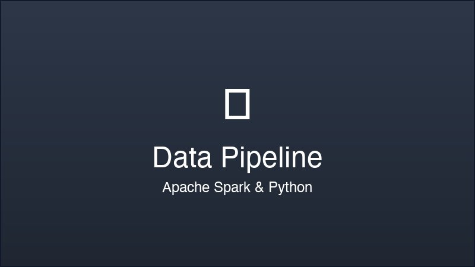
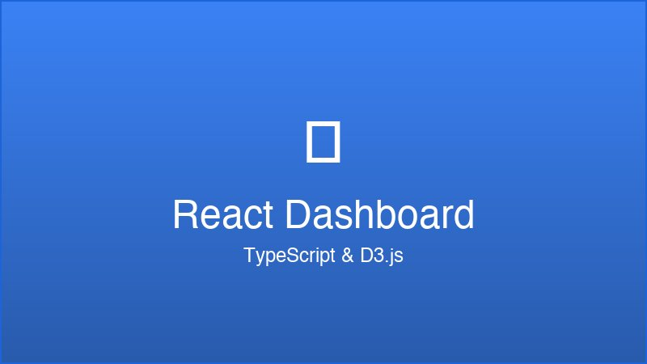

# 📸 Image Guide for Your Portfolio

## 📁 Directory Structure
```
your-portfolio/
├── images/
│   ├── profile/
│   │   ├── profile.jpg          # Main profile photo (400x400px)
│   │   └── profile-sm.jpg       # Small version (200x200px)
│   ├── projects/
│   │   ├── data-pipeline.jpg    # Data engineering project
│   │   ├── react-dashboard.jpg  # Web development project
│   │   ├── ml-prediction.jpg    # Machine learning project
│   │   └── [your-projects].jpg  # Your actual projects
│   └── icons/
│       ├── logo.png             # Personal logo/brand
│       └── favicon.ico          # Website favicon
```

## 🖼️ Image Requirements

### Profile Photo
**File**: `images/profile/profile.jpg`
- **Size**: 400x400px (square)
- **Format**: JPG or PNG
- **Quality**: High resolution, professional photo
- **Style**: Headshot or professional portrait

### Project Screenshots
**Location**: `images/projects/`
- **Size**: 800x450px (16:9 ratio) recommended
- **Format**: JPG or PNG
- **Quality**: High resolution, clear screenshots
- **Content**:
  - Dashboard screenshots
  - Application interfaces
  - Data visualizations
  - Code screenshots
  - Architecture diagrams

## 📝 How to Add Your Images

### 1. Add Profile Photo
1. Save your photo as `images/profile/profile.jpg`
2. The HTML is already configured to display it
3. Fallback icon shows if image is missing

### 2. Add Project Images
1. Save project screenshots in `images/projects/`
2. Update the image names in HTML:

```html
<!-- Current project image names -->



```

### 3. Add Favicon (Optional)
1. Save favicon as `images/icons/favicon.ico`
2. Add to HTML `<head>`:
```html
<link rel="icon" type="image/x-icon" href="images/icons/favicon.ico">
```

## 🎨 Image Optimization Tips

### Before Adding Images:
1. **Resize**: Use tools like Photoshop, GIMP, or online tools
2. **Compress**: Use TinyPNG, ImageOptim, or similar
3. **Format**:
   - JPG for photos
   - PNG for graphics with transparency
   - WebP for modern browsers (optional)

### Recommended Tools:
- **Online**: TinyPNG, Squoosh.app, Canva
- **Desktop**: Photoshop, GIMP, Preview (Mac)
- **CLI**: ImageMagick, Sharp

## 📱 Responsive Images (Advanced)

For better performance, you can add multiple sizes:

```html

```

## 🔄 Current Image Status

### ✅ Ready for Images:
- Profile photo placeholder with fallback
- Project image placeholders with fallbacks
- Hover effects and animations
- Responsive design
- Error handling (shows icon if image fails)

### 📋 Your Next Steps:
1. **Take/Choose Profile Photo**: Professional headshot
2. **Gather Project Screenshots**: 3-6 of your best projects
3. **Optimize Images**: Resize and compress
4. **Upload Images**: Place in correct directories
5. **Test**: Check website displays images correctly

## 🖥️ Where Images Appear

### Profile Photo:
- **Hero Section**: Large circular image
- **Hover Effect**: Slight scale animation
- **Fallback**: User icon if image missing

### Project Images:
- **Projects Section**: Featured projects grid
- **All Projects Section**: Comprehensive project showcase
- **Hover Effect**: Scale and lift animation
- **Fallback**: Category icons if images missing

## 🚀 Pro Tips

1. **Consistent Style**: Use similar lighting/style for project screenshots
2. **Alt Text**: Always include descriptive alt text for accessibility
3. **File Names**: Use descriptive, SEO-friendly names
4. **Loading**: Consider lazy loading for better performance
5. **Backup**: Keep original high-res versions of all images

## 📊 Image Performance

Current implementation includes:
- ✅ Error handling with fallbacks
- ✅ Hover animations
- ✅ Responsive design
- ✅ SEO-friendly alt tags
- ✅ Progressive enhancement

Your portfolio is ready for images! Just add your photos to the `images/` directory and they'll automatically display with professional styling and animations.